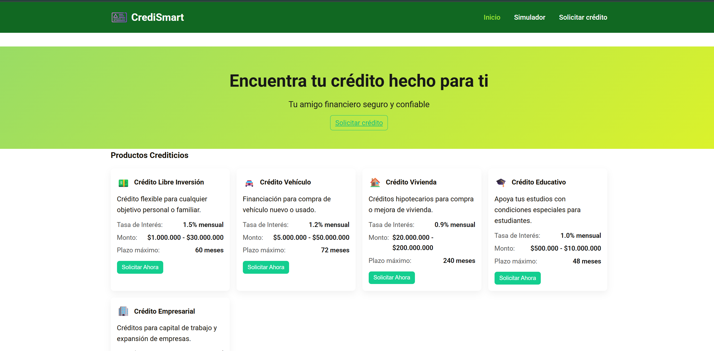
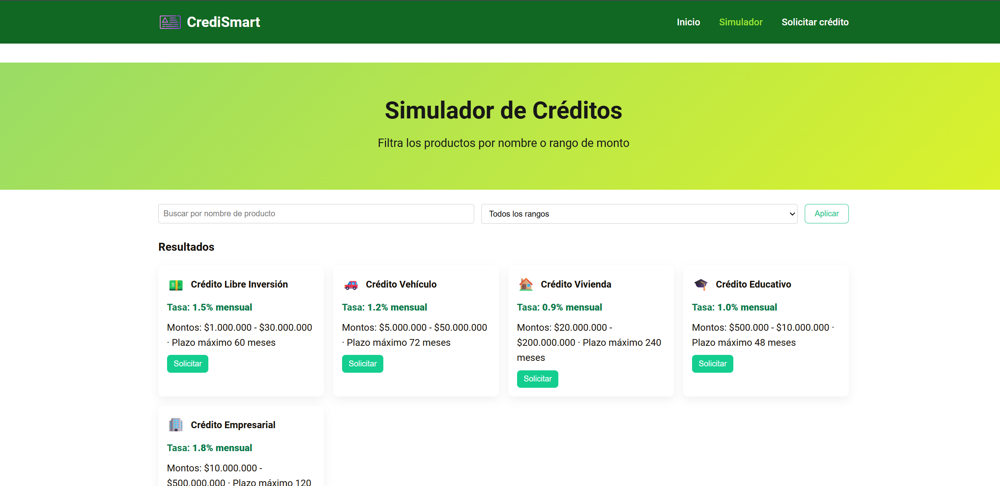
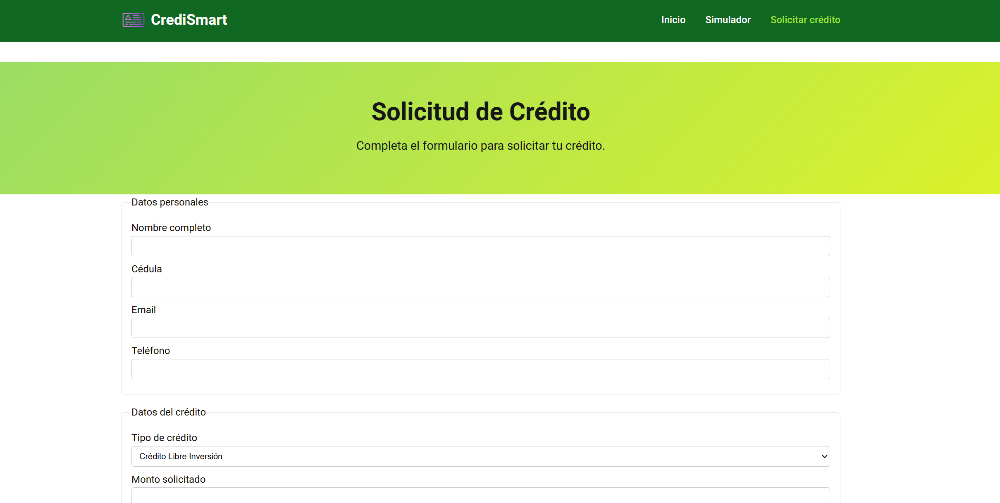

# CreditSmart — S20 EA1: Diseño de Interfaces Web
Estudiante : Hansel Raul Zambrano Lizarazo

## Descripción

Sistema web estático para consultar productos crediticios, simular préstamos y solicitar créditos. Desarrollado con HTML5 y CSS3 responsive.

## Estructura de Archivos

```
CrediSmart/
│
├── index.html          # Página principal - Catálogo de créditos
├── simulador.html      # Simulador con filtros de búsqueda
├── solicitar.html      # Formulario de solicitud
├── styles.css          # Estilos consolidados y responsive
├── IMG/
│   └── tarjeta-de-visita.png
└── README.md
```

## Cómo Ejecutar

1. Abrir index.html con doble clic o desde un navegador
2. Navegar entre las páginas usando el menú superior

## Capturas de Pantalla

### 1. Página de Inicio (Catálogo)


### 2. Simulador


### 3. Solicitar Crédito



